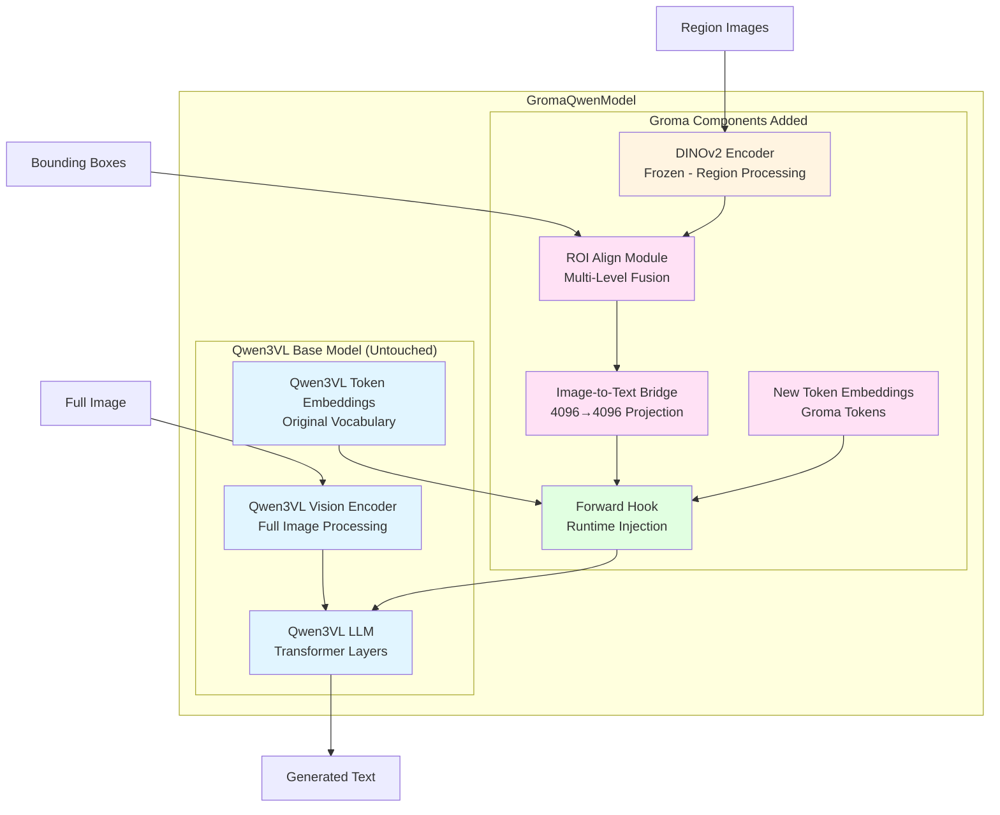
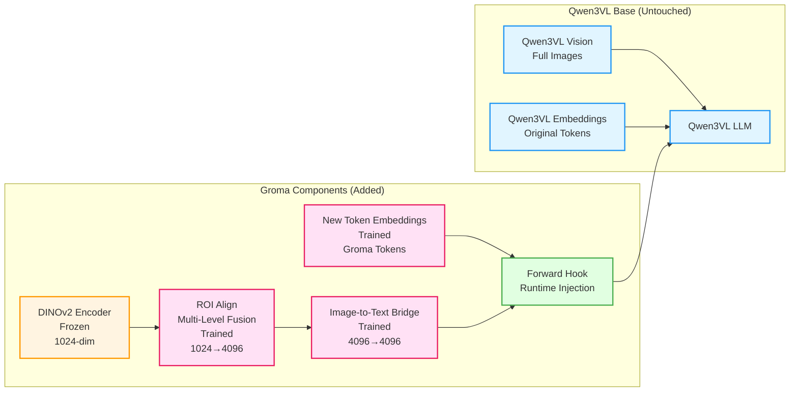
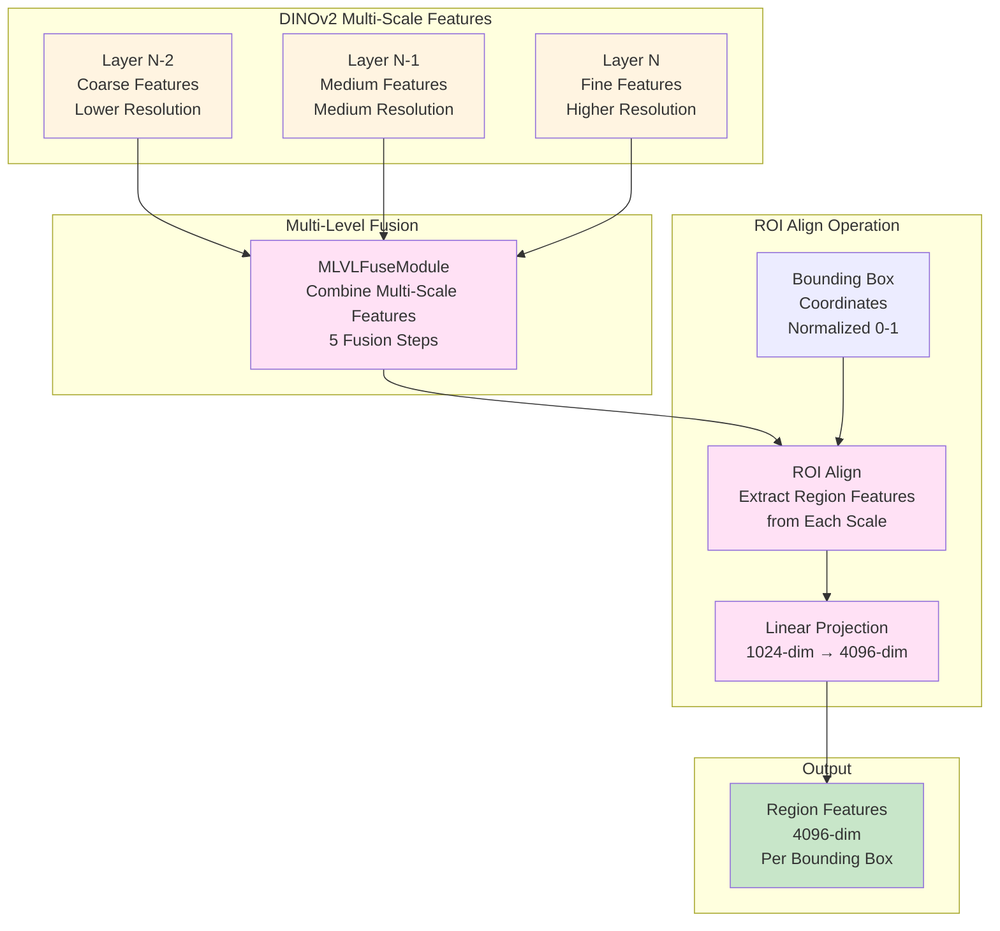
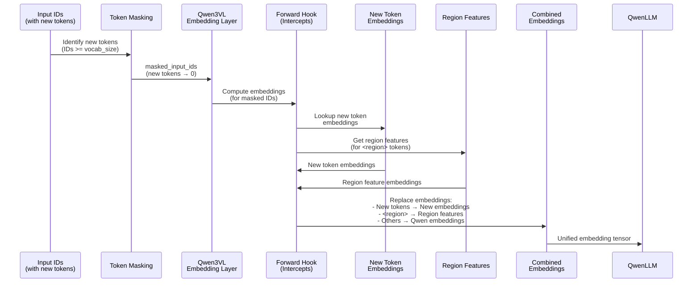
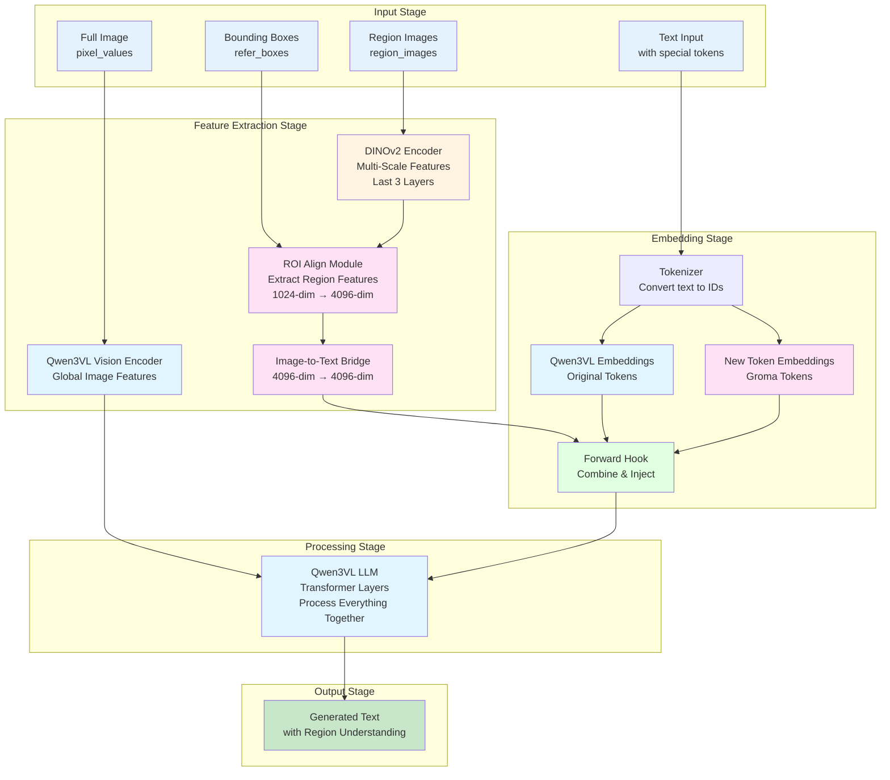
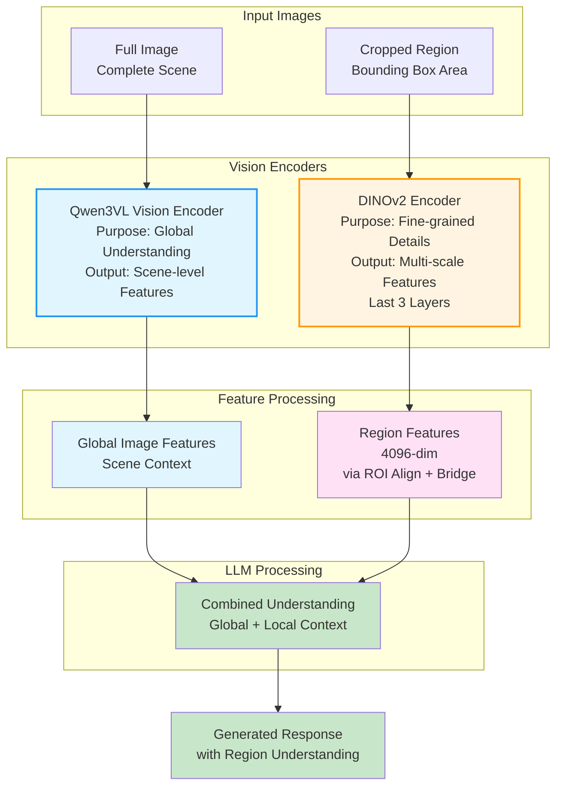
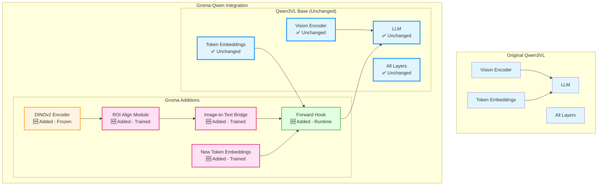

# Retrain Groma-Qwen with Qwen3-VL-7B-Instruct Native Chat Template

## Problem Analysis

**Root Cause**: Training uses `conv_llava` template (adds `</s>` as string → token ID 128247) while inference uses Qwen3-VL-7B-Instruct template (expects `<|im_end|>` token ID 151645). This mismatch causes:

- Model learns to generate text token 128247 instead of EOS token 151645
- Generation never stops because it's looking for the wrong token
- Training/inference inconsistency

**Solution**: Retrain with Qwen3-VL-7B-Instruct's native chat template to ensure consistency and proper EOS handling.

---

## Architecture Summary: Integrating Groma into Qwen3VL

### Overview

The integration of Groma into Qwen3VL follows a **non-invasive, additive approach**. Instead of modifying the base Qwen3VL model, we add Groma-specific components on top of it. This ensures that the original Qwen3VL architecture remains completely untouched, preserving all its capabilities while adding region understanding functionality.

### Key Design Principle: Non-Invasive Integration

The entire integration is built on the principle of **zero modifications** to the base Qwen3VL model. We achieve this through:
1. **Inheritance**: `GromaQwenModel` inherits from `Qwen3VLForConditionalGeneration` without changing any internal components
2. **Separate components**: All Groma-specific modules are added as separate, parallel components
3. **Runtime injection**: Custom embeddings are injected using PyTorch forward hooks, avoiding any permanent modifications

### Architecture Overview Diagram



**Legend**:
- 🔵 **Blue boxes**: Qwen3VL components (untouched)
- 🟡 **Yellow box**: DINOv2 (frozen, not trained)
- 🟣 **Pink boxes**: Groma components (trained)
- 🟢 **Green box**: Hook mechanism (runtime injection)

---

## Architectural Components

### Part 1: The Base Model (Qwen3VL - Completely Untouched)

**What it is**: Qwen3VL-7B-Instruct is a powerful vision-language model that can process full images and generate text responses.

**What we keep unchanged**:
- **Vision Encoder**: Processes full images (`pixel_values`) to extract global image features
- **Language Model (LLM)**: The transformer-based text generation backbone
- **Token Embeddings**: Original vocabulary embeddings remain at their original size
- **All Internal Layers**: Attention mechanisms, feed-forward networks, normalization layers - everything stays exactly as it was
- **Architecture**: The entire transformer structure, including positional encodings, remains intact

**Why we don't modify it**: 
- Qwen3VL is a well-trained, production-ready model with excellent vision-language capabilities
- Modifying it could break existing functionality or degrade performance
- Keeping it untouched allows us to leverage all its pre-trained knowledge

**How we use it**:
- Full images are still processed by Qwen3VL's vision encoder
- Text generation still happens through Qwen3VL's LLM
- We simply add additional components that work alongside it

---

### Part 2: Groma Components Added (New Additions Only)

### Component Architecture Diagram



**Component Status**:
- 🟡 **Frozen** (DINOv2): Pre-trained weights, never updated
- 🟣 **Trained** (ROI Align, Bridge, New Embeddings): Updated during training
- 🟢 **Runtime** (Hook): Temporary mechanism, no weights
- 🔵 **Untouched** (Qwen3VL): Original model, never modified

#### Component 1: Region Visual Encoder (DINOv2-Large)

**What it is**: A separate, frozen vision encoder based on DINOv2-Large architecture.

**Purpose**: Extract fine-grained visual features from cropped region images. While Qwen3VL processes full images for global understanding, DINOv2 focuses on detailed region-level features.

**Key characteristics**:
- **Separate from Qwen3VL**: It's a completely independent module (`self.vis_encoder = Dinov2Model()`)
- **Frozen**: Set to `requires_grad_(False)`, meaning it's never trained - we use pre-trained DINOv2 weights as-is
- **Different input**: Only processes cropped region images (`region_images`), NOT full images
- **Different purpose**: Qwen3VL sees the whole picture; DINOv2 sees the details

**Why DINOv2**:
- DINOv2 is specifically designed for dense visual feature extraction
- It provides multi-scale features that are perfect for region understanding
- Pre-trained on large-scale data, so we can use it directly without training

**How it works**:
1. Takes cropped region images as input (e.g., a bounding box around a person)
2. Processes them through DINOv2's transformer layers
3. Outputs multi-scale feature maps from the last 3 layers
4. These features capture fine-grained visual details that complement Qwen3VL's global view

---

#### Component 2: Region Encoder Head (ROI Align + Multi-Level Fusion)

**What it is**: A module that extracts region-of-interest (ROI) features from DINOv2's multi-scale features using bounding box coordinates.

**Purpose**: Convert DINOv2's patch-level features into region-level features that represent specific bounding boxes.

**Key characteristics**:
- **Component**: `self.region_encoder = MLVLROIQueryModule()`
- **Trained**: This component IS trained during Stage 2 and Stage 3
- **Input**: DINOv2 multi-scale features (from last 3 layers) + bounding box coordinates
- **Output**: Region features of dimension 4096

**How it works**:
1. **Multi-Level Feature Fusion**: Takes features from DINOv2's last 3 layers (different scales/resolutions)
2. **ROI Align**: Uses bounding box coordinates to extract features from specific regions in each scale
3. **Feature Fusion**: Combines multi-scale features to create rich, scale-invariant region representations
4. **Dimension Expansion**: Projects from DINOv2's dimension (1024) to LLM dimension (4096)

**Why ROI Align**:
- ROI Align is a standard technique for extracting features from specific image regions
- It handles bounding boxes of different sizes and aspect ratios
- Multi-level fusion ensures we capture both fine details and broader context

**Technical details**:
- Uses `MlvlRoIExtractor` which performs ROI Align at multiple scales
- Features from different scales are fused together
- Final output is 4096-dimensional, matching the LLM's hidden dimension

### ROI Align Process Diagram



**Process Flow**:
1. **Extract Multi-Scale Features**: Get features from DINOv2's last 3 layers (different resolutions)
2. **Fuse Scales**: Combine features from different scales to capture both fine details and broader context
3. **ROI Align**: Extract features corresponding to bounding box regions at each scale
4. **Dimension Expansion**: Project from DINOv2 dimension (1024) to LLM dimension (4096)
5. **Output**: Region-specific features ready for LLM processing

---

#### Component 3: Image-to-Text Bridge

**What it is**: A simple neural network that projects region features into the LLM's embedding space.

**Purpose**: Ensure region features are in the same space as text embeddings so the LLM can process them together.

**Key characteristics**:
- **Component**: `self.img_txt_bridge = nn.Sequential(Linear(4096→4096), GELU, Linear(4096→4096))`
- **Trained**: This component IS trained during Stage 2 and Stage 3
- **Input**: Region features from ROI encoder (4096-dim)
- **Output**: Projected features (4096-dim) matching LLM embedding dimension

**Why it's needed**:
- Even though dimensions match (4096), the feature spaces are different
- Region features come from visual processing; text embeddings come from token processing
- The bridge learns to align these spaces so the LLM can understand region features as if they were text-like embeddings

**How it works**:
1. Takes 4096-dimensional region features
2. Passes through two linear layers with GELU activation
3. Outputs 4096-dimensional features that are compatible with LLM processing

**Why this architecture**:
- Simple and effective: two linear layers with activation provide enough flexibility
- GELU activation is standard in transformer models
- The projection learns to translate visual features into a format the LLM understands

---

#### Component 4: New Token Embeddings

**What it is**: A separate embedding layer for Groma-specific tokens.

**Purpose**: Provide embeddings for special tokens that Groma uses for region understanding (`<region>`, `<r0>` to `<r99>`, `<p>`, `<roi>`, etc.).

**Key characteristics**:
- **Component**: `self.new_input_embs = nn.Embedding(num_new_token, text_embed_dim)`
- **Trained**: This component IS trained during Stage 2 and Stage 3
- **Separate layer**: Does NOT resize or modify Qwen3VL's original embeddings
- **Initialization**: Initialized as the average of existing Qwen embeddings (smart initialization)

**Why separate embeddings**:
- Qwen3VL's vocabulary doesn't include Groma-specific tokens
- We need to add new tokens without disrupting existing ones
- Keeping them separate ensures we don't accidentally break Qwen3VL's pre-trained token understanding

**How it works**:
1. New tokens are added to the tokenizer vocabulary (e.g., `<region>`, `<r0>`, `<p>`, `<roi>`)
2. These tokens get IDs beyond Qwen3VL's original vocabulary size
3. When these tokens appear in input, we use `new_input_embs` instead of Qwen3VL's embeddings
4. During training, these embeddings learn to represent Groma-specific concepts

**Why average initialization**:
- Starting with average Qwen embeddings gives new tokens a reasonable starting point
- They're not random, so training converges faster
- They inherit some general language understanding from Qwen3VL

---

#### Component 5: Forward Hook Mechanism (Runtime Injection)

**What it is**: A PyTorch forward hook that intercepts the embedding lookup process to inject custom embeddings.

**Purpose**: Inject region features and new token embeddings into the model WITHOUT modifying the base Qwen3VL code.

**Key characteristics**:
- **Non-invasive**: Uses PyTorch's hook system - no code changes to Qwen3VL
- **Runtime**: Happens during forward pass, not at model initialization
- **Temporary**: Hook is registered before forward pass and removed after

**Why hooks instead of direct modification**:
- Qwen3VL requires `input_ids` for positional encoding (RoPE), but forbids passing both `input_ids` and `inputs_embeds`
- We need to inject custom embeddings while still using `input_ids` for positional encoding
- Hooks allow us to intercept and modify embeddings without changing Qwen3VL's code

**How it works**:
1. **Mask new tokens**: Replace new token IDs with valid Qwen3VL token IDs (e.g., 0) so Qwen3VL's embedding layer doesn't crash
2. **Register hook**: Attach a forward hook to Qwen3VL's embedding layer
3. **Hook intercepts**: When Qwen3VL computes embeddings, our hook intercepts the output
4. **Inject custom embeddings**: 
   - Replace masked positions with new token embeddings
   - Replace `<region>` token positions with projected region features
5. **Remove hook**: Clean up after forward pass

**Technical details**:
```python
# Mask new tokens to avoid embedding lookup errors
masked_input_ids = input_ids.masked_fill(new_token_mask, 0)

# Define hook function
def embedding_hook(module, inputs, output):
    # Inject new token embeddings
    output[new_token_mask] = new_embeds[new_token_mask]
    # Inject region features at <region> positions
    output[reg_mask] = region_features_proj
    return output

# Register hook
hook_handle = model.get_input_embeddings().register_forward_hook(embedding_hook)
# Forward pass (hook intercepts embeddings)
output = super().forward(input_ids=masked_input_ids, ...)
# Remove hook
hook_handle.remove()
```

**Why this approach**:
- Completely non-invasive: Qwen3VL code never changes
- Flexible: Can inject different embeddings for different tokens
- Safe: Hook is temporary, so no permanent modifications
- Compatible: Works with Qwen3VL's requirements for `input_ids`

### Forward Hook Mechanism Diagram



**Key Steps**:
1. **Mask**: New token IDs are replaced with valid IDs (0) to prevent embedding lookup errors
2. **Intercept**: Hook catches Qwen3VL's embedding output
3. **Inject**: Hook replaces masked positions with custom embeddings
4. **Combine**: All embeddings unified into single tensor
5. **Process**: Combined embeddings passed to Qwen3VL LLM

---

## Data Flow: How Everything Works Together

### Complete Data Flow Diagram



### Training/Inference Flow

1. **Input Preparation**:
   - Full image → Qwen3VL's vision encoder (via `pixel_values`)
   - Cropped region images → DINOv2 encoder (via `region_images`)
   - Bounding boxes → ROI Align module (via `refer_boxes`)
   - Text with special tokens → Tokenizer

2. **Feature Extraction**:
   - Qwen3VL processes full image → Global image features
   - DINOv2 processes regions → Multi-scale region features
   - ROI Align extracts features for each bounding box → Region-specific features (4096-dim)
   - Bridge projects region features → LLM-compatible features (4096-dim)

3. **Embedding Injection**:
   - Text tokens → Qwen3VL's embedding layer (normal tokens) + New embedding layer (Groma tokens)
   - Region features → Injected at `<region>` token positions via hook
   - Everything combined → Unified embedding tensor

4. **LLM Processing**:
   - Combined embeddings → Qwen3VL's LLM
   - LLM processes everything together (text + global image + region features)
   - Output → Generated text with region understanding

### Key Insight: Dual Vision Processing

The architecture uses **two vision encoders for different purposes**:
- **Qwen3VL Vision Encoder**: Processes full images for global scene understanding
- **DINOv2 Encoder**: Processes cropped regions for fine-grained region understanding

This dual approach gives the model both:
- **Global context**: Understanding the whole scene (from Qwen3VL)
- **Local details**: Understanding specific regions (from DINOv2)

### Dual Vision Processing Diagram



**Why Two Encoders?**
- **Complementary Information**: Qwen3VL provides global context, DINOv2 provides local details
- **Different Optimizations**: Each encoder is optimized for its specific task
- **Better Understanding**: Combining both gives richer understanding than either alone

---

## Why This Architecture?

### Design Decisions Explained

1. **Why keep Qwen3VL untouched?**
   - Preserves all pre-trained knowledge and capabilities
   - Avoids breaking existing functionality
   - Allows leveraging Qwen3VL's excellent vision-language understanding

2. **Why add DINOv2 instead of using Qwen3VL for regions?**
   - Qwen3VL is optimized for full-image understanding
   - DINOv2 is specifically designed for dense feature extraction
   - Using both gives complementary information (global + local)

3. **Why ROI Align?**
   - Standard technique for region feature extraction
   - Handles variable-sized bounding boxes
   - Multi-level fusion captures features at different scales

4. **Why separate token embeddings?**
   - Doesn't disrupt Qwen3VL's vocabulary
   - Allows adding new tokens without retraining base model
   - Keeps Groma-specific tokens isolated

5. **Why forward hooks?**
   - Only way to inject embeddings while respecting Qwen3VL's `input_ids` requirement
   - Completely non-invasive
   - Flexible and safe

### Benefits of This Approach

- **Modularity**: Each component has a clear purpose and can be understood independently
- **Maintainability**: Changes to Groma components don't affect Qwen3VL
- **Flexibility**: Can easily add or modify Groma components without touching base model
- **Safety**: Base model remains stable and reliable
- **Performance**: Leverages pre-trained models effectively

---

## Summary: What Changed and What Didn't

### Architecture Comparison Diagram



### What We Added (Groma Components):
1. ✅ DINOv2 region encoder (frozen)
2. ✅ ROI Align + Multi-level fusion module (trained)
3. ✅ Image-to-text bridge (trained)
4. ✅ New token embeddings layer (trained)
5. ✅ Forward hook mechanism (runtime injection)

### What We Kept Unchanged (Qwen3VL):
1. ✅ Vision encoder for full images
2. ✅ Language model (LLM)
3. ✅ Original token embeddings
4. ✅ All transformer layers
5. ✅ All attention mechanisms
6. ✅ All normalization and activation functions
7. ✅ Positional encodings
8. ✅ Everything else!

### The Result:
A model that combines:
- Qwen3VL's powerful vision-language understanding
- Groma's fine-grained region understanding
- All working together seamlessly through non-invasive integration

---

## Implementation Plan

### ⚠️ CRITICAL FIRST STEP: Regenerate Training Datasets with Qwen3VL Template Format

**MUST BE COMPLETED BEFORE ANY CODE CHANGES**

**New Script: `Groma/scripts/regenerate_datasets_qwen3vl.py`**

1. **Analyze current dataset format**:

   - Read `Groma/groma_data/benchmarks/hico_qwen_v3.json` (162,445 samples)
   - Read `Groma/groma_data/benchmarks/swig_qwen_v3.json` (120,312 samples)
   - Current format: `{"from": "human"/"gpt", "value": "...", "box_inds": [...]}`
   - Understand conversation structure and metadata (boxes, action, object_category, etc.)

2. **Load Qwen3-VL-8B-Instruct tokenizer and processor from local checkpoint**:

   - Load tokenizer from `Groma/checkpoints/Qwen3-VL-8B-Instruct` (local checkpoint)
   - Load processor from `Groma/checkpoints/Qwen3-VL-8B-Instruct` (local checkpoint)
   - **CRITICAL**: Use Qwen3-VL (NOT Qwen2-VL) - verify model name contains "Qwen3-VL"
   - Verify `apply_chat_template()` method is available
   - Understand Qwen3-VL-8B-Instruct message format requirements
   - Example loading:
     ```python
     from transformers import AutoTokenizer, AutoProcessor
     
     checkpoint_path = "Groma/checkpoints/Qwen3-VL-8B-Instruct"
     tokenizer = AutoTokenizer.from_pretrained(checkpoint_path, trust_remote_code=True)
     processor = AutoProcessor.from_pretrained(checkpoint_path, trust_remote_code=True)
     ```

3. **Convert conversations to Qwen3-VL-8B-Instruct message format**:

   - Transform `{"from": "human", "value": "..."}` → `{"role": "user", "content": [...]}`
   - Transform `{"from": "gpt", "value": "..."}` → `{"role": "assistant", "content": "..."}`
   - Add system message: `{"role": "system", "content": "Here is an image with region crops from it. Image: <image>. Regions: <region>."}`
   - For user messages with images: `{"role": "user", "content": [{"type": "image", "image": "placeholder"}, {"type": "text", "text": "[grounding] Identify..."}]}`
   - Preserve all Groma tokens (`<p>`, `<roi>`, coordinates like `(x1,y1),(x2,y2)`, etc.)
   - Keep all metadata: boxes, box_inds, action, object_category, width, height, file_name

4. **Validate Qwen3-VL-8B-Instruct template format**:

   - Use `tokenizer.apply_chat_template(messages, tokenize=False)` to verify format
   - Ensure `<|im_start|>` and `<|im_end|>` tokens are added correctly
   - Verify EOS token ID 151645 (`<|im_end|>`) appears at end of assistant responses
   - Test with a few sample conversations
   - **Verify**: Template format matches Qwen3-VL (not Qwen2-VL) - check for Qwen3-VL specific tokens

5. **Generate new dataset files**:

   - Option A: Create new files `hico_qwen_v3_qwen3vl.json` and `swig_qwen_v3_qwen3vl.json`
   - Option B: Overwrite existing files (backup first)
   - Preserve JSON structure: array of objects with all original fields
   - Add new field `messages` with Qwen3-VL-8B-Instruct format (or replace `conversation` field)
   - Ensure no data loss: same number of samples, boxes, metadata

6. **Validation checks**:

   - Verify dataset structure matches expected format
   - Check that all conversations are properly formatted
   - Ensure no data loss (same number of samples, boxes, etc.)
   - Test tokenization: verify EOS tokens (151645) are added correctly
   - Compare tokenized output: old format vs new format (should have `<|im_end|>` instead of `</s>`)
   - **Verify**: Tokenizer is from Qwen3-VL (check tokenizer config/model name)

### Phase 2: Create Qwen3-VL-8B-Instruct-Compatible Dataset Processor

**File: `Groma/groma/data/datasets/groma_qwen.py`**

1. **Replace `conv_llava` template with Qwen3-VL-8B-Instruct message format**:

   - Remove dependency on `conv_templates['llava']` and `get_prompt()` method
   - Load Qwen3-VL-8B-Instruct processor/tokenizer from `Groma/checkpoints/Qwen3-VL-8B-Instruct` with `apply_chat_template()` method
   - **CRITICAL**: Use Qwen3-VL (NOT Qwen2-VL) - load from local checkpoint path
   - Convert conversation format to Qwen3-VL-8B-Instruct message structure in `preprocess()` method
   - Use `tokenizer.apply_chat_template(messages, tokenize=True)` instead of manual prompt construction
   - This automatically handles `<|im_start|>` and `<|im_end|>` tokens correctly

2. **Preserve Groma-specific tokens**:

   - Ensure `<p>`, `<roi>`, `<region>`, etc. are added to tokenizer vocabulary
   - These tokens work alongside Qwen3-VL-8B-Instruct template tokens

3. **Handle image and region inputs**:

   - Qwen3VL template supports multi-modal content (image + text)
   - Region features need to be injected at `<region>` token positions
   - Maintain compatibility with existing ROI Align pipeline

4. **Update target masking logic**:

   - Ensure labels are properly masked (only assistant responses are trained)
   - EOS token (151645) should be included in targets for training

### Phase 3: Update Dataset Configuration

**File: `Groma/groma/data/configs/vl_finetune_hoi_combined_qwen.py`**

1. **Update dataset paths**:

   - Point to regenerated datasets (`hico_qwen_v3_qwen3vl.json` and `swig_qwen_v3_qwen3vl.json`)
   - Or verify existing paths work if overwritten

2. **Remove `conv_temp` parameter**:

   - Remove `'conv_temp': 'llava'` (no longer needed with Qwen3VL template)
   - Dataset processor will use Qwen3VL template directly

### Phase 4: Verify Training Script Compatibility

**File: `Groma/groma/train/train_qwen.py`**

1. **Ensure tokenizer setup**:

   - Qwen3VL tokenizer is loaded correctly from `Groma/checkpoints/Qwen3-VL-8B-Instruct`
   - **CRITICAL**: Verify it's Qwen3-VL (not Qwen2-VL) - check model name/config
   - Groma special tokens are added to vocabulary
   - Tokenizer has `apply_chat_template` method available

2. **Verify EOS token handling**:

   - Training should use `eos_token_id=151645` (`<|im_end|>`)
   - Loss computation should include EOS token in targets

### Phase 5: Update Inference Script

**File: `Groma/scripts/run_groma_qwen.py`**

1. **Clean up debug code**
2. **Verify EOS token handling**:

   - Qwen3VL's `apply_chat_template` already adds `<|im_end|>` correctly
   - Ensure `eos_token_id=151645` is used in generation
   - Verify generation stops correctly at EOS token
   - **Ensure**: Tokenizer/processor loaded from `Groma/checkpoints/Qwen3-VL-8B-Instruct` (Qwen3-VL, not Qwen2-VL)

### Phase 6: Testing & Validation

1. **Test dataset preprocessing**: Verify Qwen3VL message format and EOS tokens (151645)
2. **Test training**: Run Stage 2 and Stage 3 with new template, verify loss decreases
3. **Test inference**: Verify generation stops correctly and Groma tokens work
4. **Verify model identity**: Confirm all components use Qwen3-VL (not Qwen2-VL) throughout pipeline

## Key Implementation Details

### Qwen3VL Message Format

```python
messages = [
    {
        "role": "system",
        "content": "Here is an image with region crops from it. Image: <image>. Regions: <region>."
    },
    {
        "role": "user",
        "content": [
            {"type": "image", "image": PIL.Image},
            {"type": "text", "text": "[grounding] Identify the following..."}
        ]
    },
    {
        "role": "assistant",
        "content": "<p> person </p> <roi> (x1,y1),(x2,y2) </roi> ..."
    }
]
```

### Tokenization Flow

1. Convert conversations to Qwen3VL message format
2. Use `tokenizer.apply_chat_template(messages, tokenize=True)` 
3. Template automatically adds `<|im_end|>` (EOS token ID 151645) at end of assistant responses

### Model Loading (Qwen3-VL, NOT Qwen2-VL)

**CRITICAL**: Always load from local checkpoint to ensure Qwen3-VL:

```python
from transformers import AutoTokenizer, AutoProcessor, Qwen3VLForConditionalGeneration

checkpoint_path = "Groma/checkpoints/Qwen3-VL-8B-Instruct"

# Load tokenizer and processor
tokenizer = AutoTokenizer.from_pretrained(checkpoint_path, trust_remote_code=True)
processor = AutoProcessor.from_pretrained(checkpoint_path, trust_remote_code=True)

# Verify it's Qwen3-VL (not Qwen2-VL)
assert "Qwen3-VL" in tokenizer.name_or_path or "qwen3" in tokenizer.name_or_path.lower()
```

## Files to Modify

1. **`Groma/scripts/regenerate_datasets_qwen3vl.py`** (NEW): Script to regenerate datasets with Qwen3VL template format - **MUST RUN FIRST**
   - Load tokenizer/processor from `Groma/checkpoints/Qwen3-VL-8B-Instruct`
   - Verify Qwen3-VL (not Qwen2-VL)
2. **`Groma/groma/data/datasets/groma_qwen.py`**: Rewrite `preprocess()` to use Qwen3VL template
   - Load from `Groma/checkpoints/Qwen3-VL-8B-Instruct`
   - Verify Qwen3-VL (not Qwen2-VL)
3. **`Groma/groma/data/configs/vl_finetune_hoi_combined_qwen.py`**: Update dataset paths and remove conv_temp parameter
4. **`Groma/groma/train/train_qwen.py`**: Ensure tokenizer loaded from `Groma/checkpoints/Qwen3-VL-8B-Instruct`
   - Verify Qwen3-VL (not Qwen2-VL)
5. **`Groma/scripts/run_groma_qwen.py`**: Clean up debug code, ensure Qwen3-VL checkpoint path

## Success Criteria

1. ✅ Datasets regenerated with Qwen3VL message format (CRITICAL FIRST STEP)
2. Training uses Qwen3VL native chat template from `Groma/checkpoints/Qwen3-VL-8B-Instruct`
3. EOS token ID (151645) is properly added during training
4. Groma-specific tokens work correctly
5. Model learns to generate EOS token (151645)
6. Inference stops correctly at `<|im_end|>` token
7. Training and inference use consistent template format
8. Qwen3VL base architecture remains completely untouched
9. Groma components work seamlessly via hook mechanism
10. **All components verified to use Qwen3-VL (NOT Qwen2-VL) throughout the pipeline**

---

## Latest Updates: Grounding Task Fixes (2024)

### Problem Identified: Training/Inference Mismatch for Grounding Tasks

**Issue**: Grounding task performance was worse than default Qwen3VL, with incorrect coordinate generation.

**Root Cause**: 
- **Training**: Dataset created `region_images = torch.empty(0, 3, 224, 224)` (empty tensor, not None) for grounding tasks
- **Inference**: Script passed `region_images = None` (None value)
- **Mismatch**: Model saw different inputs during training vs inference, causing incorrect behavior

### Fixes Applied

#### Fix 1: Dataset Returns None for Empty Refer Boxes
**File**: `groma/data/datasets/groma_qwen.py` (Lines 331-338)

**Change**:
```python
# Before:
region_images = torch.empty(0, 3, 224, 224)  # Empty tensor

# After:
region_images = None  # None value (matches inference)
```

**Effect**: Training now matches inference - both use `None` when no `refer_boxes` are present.

#### Fix 2: Model Checks for Empty Tensors
**File**: `groma/model/groma_qwen.py` (Lines 192-200)

**Change**:
```python
# Before:
if region_images is not None and refer_boxes is not None:

# After:
has_regions = (
    region_images is not None 
    and refer_boxes is not None
    and (isinstance(region_images, torch.Tensor) and region_images.shape[0] > 0)
    and (isinstance(refer_boxes, list) and len(refer_boxes) > 0 and refer_boxes[0].shape[0] > 0)
)

if has_regions:
```

**Effect**: Defensive check prevents processing empty regions, ensuring grounding tasks skip region processing correctly.

---

## Current Training and Inference Flow

### Grounding Task Flow

**Task**: Given text description → Output bounding box coordinates  
**Example**: "person sitting on bench" → `(320,306),(359,349)`

#### Training Flow:
1. **Input**: Full image + text query `"[grounding] Identify the following person and objects in the image: person sitting on bench and the bench"`
2. **Dataset Processing** (`groma/data/datasets/groma_qwen.py`):
   - Extracts `refer_boxes` from conversation → Empty for grounding (`torch.empty(0, 4)`)
   - Prepares `region_images` → Returns `None` (FIXED: was empty tensor)
   - Extracts `ground_boxes` → Actual boxes (training target)
3. **Model Forward** (`groma/model/groma_qwen.py`):
   - Checks `has_regions` → `False` (both are `None`)
   - **Skips**: Region processing (DINOv2 + Region Encoder + VL Bridge)
   - **Uses**: Qwen3VL vision encoder processes full image (`pixel_values`)
   - Processes text through Qwen3VL LLM
   - **Output**: Generates coordinates in text format (e.g., `(x1,y1),(x2,y2)`)

#### Inference Flow:
1. **Input**: Full image + text query `"[grounding] Identify..."`
2. **Script** (`scripts/run_groma_qwen.py`):
   - Does NOT pass `region_images` (remains `None`)
   - Does NOT pass `refer_boxes` (remains `None`)
   - Passes full image via `pixel_values`
3. **Model Forward**:
   - Checks `has_regions` → `False` (both are `None`)
   - **Skips**: Region processing
   - **Uses**: Qwen3VL vision encoder processes full image
   - Processes text through Qwen3VL LLM
   - **Output**: Generates coordinates in text format

**✓ Training and Inference MATCH**: Both use `None` for `region_images` and `refer_boxes`, both skip region processing, both use Qwen3VL vision encoder for full image.

### Referring Task Flow

**Task**: Given bounding boxes → Output action description  
**Example**: `[320,306,359,349]` + `[148,345,376,414]` → `"sitting on bench"`

#### Training Flow:
1. **Input**: Full image + text query with `<refer_feat>` tokens
   - Query: `"What is <roi><refer_box>500,716,560,817</refer_box></roi><refer_feat> doing with <roi><refer_box>231,807,587,969</refer_box></roi><refer_feat>?"`
2. **Dataset Processing**:
   - Extracts `refer_boxes` from user query → Actual boxes (`torch.tensor(N, 4)`)
   - Prepares `region_images` → Crops regions and returns `tensor(N, 3, 224, 224)` (FIXED: now properly crops)
   - Extracts `ground_boxes` → Actual boxes (training target)
3. **Model Forward**:
   - Checks `has_regions` → `True` (has regions)
   - **Processes**: 
     - DINOv2 extracts features from cropped regions
     - Region Encoder processes features with bounding box info
     - VL Bridge projects to LLM dimension
   - **Injects**: Features at `<refer_feat>` token positions (FIXED: now properly injects)
   - **Uses**: Qwen3VL vision encoder (full image) + region features (injected)
   - **Output**: Generates action text (e.g., `"sitting on bench"`)

#### Inference Flow:
1. **Input**: Full image + bounding boxes + text query
2. **Script** (`scripts/test_groma_qwen_referring.py`):
   - Crops regions from image based on bounding boxes
   - Passes `region_images = tensor(N, 3, 224, 224)`
   - Passes `refer_boxes = [tensor(N, 4)]`
3. **Model Forward**:
   - Checks `has_regions` → `True` (has regions)
   - **Processes**: DINOv2 → Region Encoder → VL Bridge
   - **Injects**: Features at `<refer_feat>` token positions
   - **Uses**: Qwen3VL vision encoder (full image) + region features
   - **Output**: Generates action text

**✓ Training and Inference MATCH**: Both use regions, both process regions, both inject features at `<refer_feat>` positions.

---

## Training Process Overview

### Stage 2: VL Alignment Pretraining

**Purpose**: Train VL Bridge and Region Encoder to extract and project region features

**Configuration**: `groma/data/configs/vl_pretrain_hoi_combined.py`

**Datasets**:
- HICO-DET Combined (grounding + referring): 162,445 samples
- SWIG-HOI Combined (grounding + referring): 120,312 samples
- Total: 282,757 samples

**Training Setup**:
- **Freeze**: LLM (Qwen3VL), Perceiver (DINOv2)
- **Train**: VL Bridge, Region Encoder, New Token Embeddings
- **Epochs**: 4
- **Batch Size**: 2 per device × 8 GPUs × 4 gradient accumulation = 64 effective

**Data Flow**:
- **Grounding samples**: `region_images=None`, `refer_boxes=None` → Skip region processing, use full image
- **Referring samples**: `region_images=tensor(N,3,224,224)`, `refer_boxes=[tensor(N,4)]` → Process regions, inject at `<refer_feat>`

**Key Fix**: Dataset returns `None` instead of empty tensor for grounding tasks, ensuring training matches inference.

### Stage 3: Instruction Finetuning

**Purpose**: Train LLM to use region features for HOI tasks (grounding + referring)

**Configuration**: `groma/data/configs/vl_finetune_hoi_combined_qwen.py`

**Datasets**: Same as Stage 2 (HICO-DET + SWIG-HOI Combined)

**Training Setup**:
- **Freeze**: Perceiver (DINOv2)
- **Train**: LLM (Qwen3VL), VL Bridge, Region Encoder, New Token Embeddings
- **Epochs**: 1
- **Batch Size**: 4 per device × 8 GPUs × 4 gradient accumulation = 128 effective

**Data Flow**: Same as Stage 2
- **Grounding samples**: Skip region processing, use full image
- **Referring samples**: Process regions, inject at `<refer_feat>`

**Key Fix**: Same fixes as Stage 2 ensure consistent behavior.

---

## Critical Fixes Summary

### Fix 1: `<refer_feat>` Feature Injection (Critical Bug)
**Location**: `groma/model/groma_qwen.py`
- **Issue**: Visual features were not injected at `<refer_feat>` token positions
- **Fix**: Added `refer_feat_token_id` initialization and injection logic in embedding hook
- **Impact**: Referring tasks now receive visual context correctly

### Fix 2: Region Images Preparation
**Location**: `groma/data/datasets/groma_qwen.py`
- **Issue**: Dataset did not prepare `region_images` from bounding boxes
- **Fix**: Added region cropping and resizing logic in `__getitem__`
- **Impact**: Referring tasks now have proper region images during training

### Fix 3: Grounding Task Training/Inference Mismatch
**Location**: `groma/data/datasets/groma_qwen.py`, `groma/model/groma_qwen.py`
- **Issue**: Training used empty tensors, inference used None → mismatch
- **Fix**: Dataset returns `None` for empty `refer_boxes`, model checks for empty tensors
- **Impact**: Grounding tasks now have consistent training/inference behavior

### Fix 4: Variable-Length Region Batching
**Location**: `groma/data/collator.py`
- **Issue**: `torch.stack()` failed when samples had different numbers of regions
- **Fix**: Changed to `torch.cat()` to concatenate all regions
- **Impact**: Batches with mixed region counts now work correctly

---

## Current Status

✅ **All fixes implemented and verified**  
✅ **Training and inference flows match for both grounding and referring tasks**  
✅ **Ready for Stage 2 retraining**  
✅ **Backward compatible with existing checkpoints**
