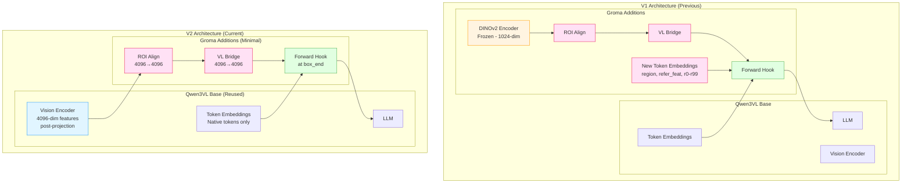
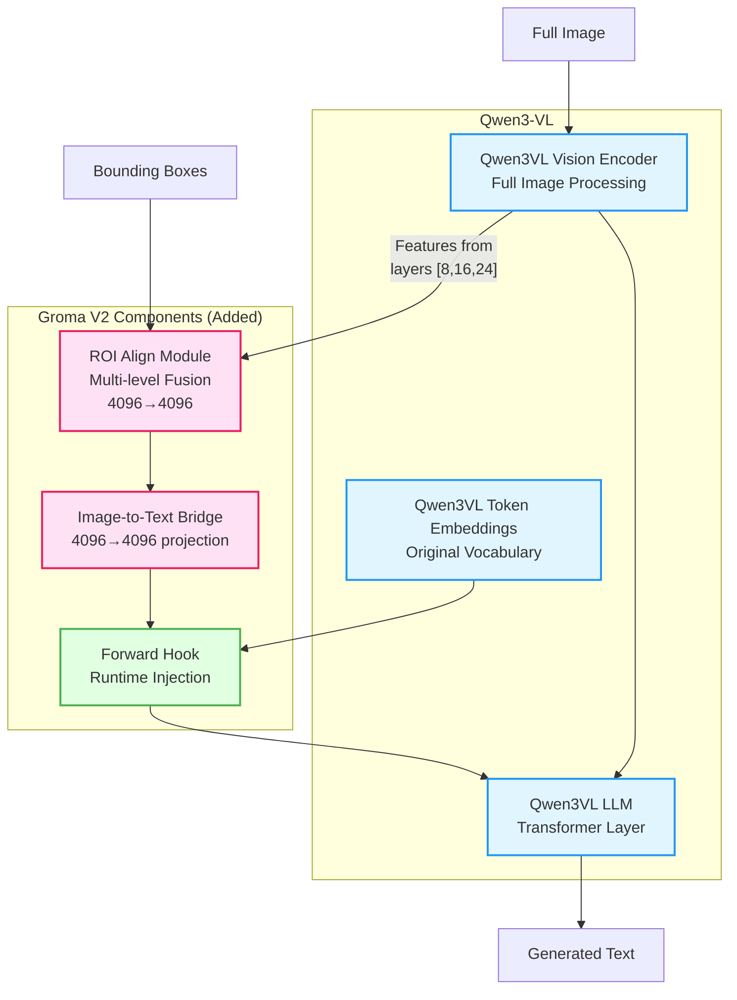
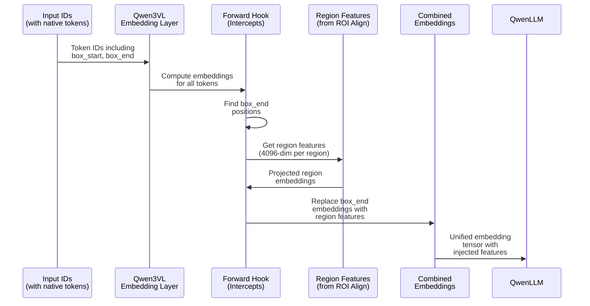
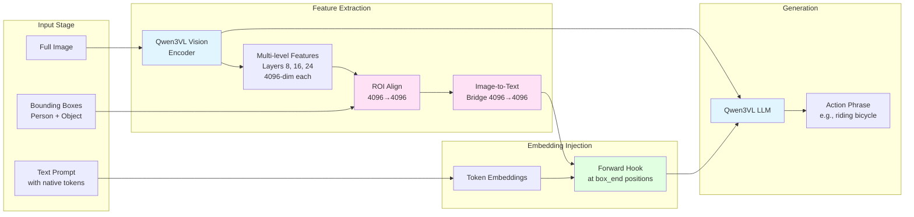
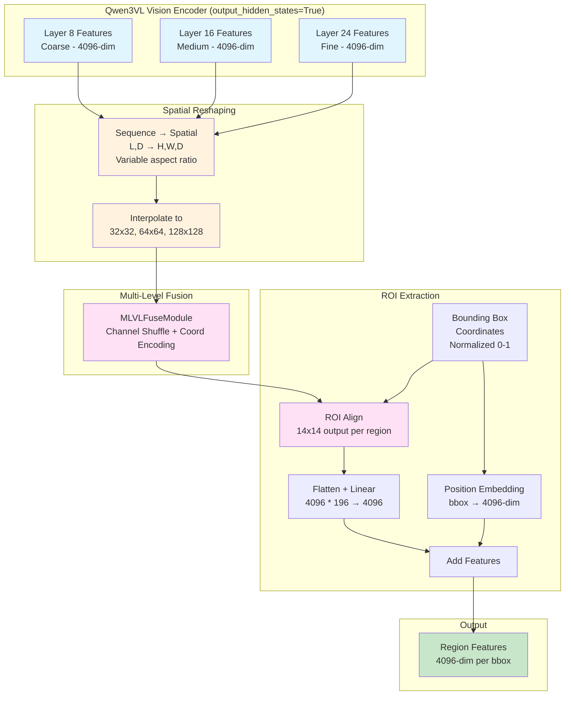

# Groma-Qwen V2: Native Qwen3VL Architecture

## Overview

Groma-Qwen V2 is a simplified architecture that integrates region-level understanding into Qwen3VL using **only native Qwen3VL components**. This approach eliminates the need for external encoders (DINOv2) and custom tokens, making the model easier to train with limited data.

### Task Formats
- **Referring Task**: Uses native Qwen3VL bbox tokens (`<|box_start|>`, `<|box_end|>`)
- **Grounding Task**: Uses JSON format (`{"bbox_2d": [x1, y1, x2, y2], "label": "..."}`) aligned with Qwen3-VL pre-trained capabilities

## Architecture Changes from V1

| Component | V1 (Previous) | V2 (Current) |
|-----------|---------------|--------------|
| Vision Encoder | DINOv2 (frozen, 1024-dim) | Qwen3VL Vision (reused, 4096-dim post-projection) |
| Custom Tokens | `<region>`, `<refer_feat>`, `<r0>`-`<r99>` | None |
| Bbox Tokens (Referring) | Custom `<roi>`, `<refer_box>` | Native `<\|box_start\|>`, `<\|box_end\|>` |
| Grounding Output | Custom tokens | JSON format (`{"bbox_2d": [...], "label": "..."}`) |
| ROI Align | 3-level from DINOv2 layers | 3-level from Qwen3VL layers [8,16,24] |
| Image-to-Text Bridge | 4096→4096 | 4096→4096 (unchanged) |
| Forward Hook | Inject at custom tokens | Inject at `<\|box_end\|>` positions |
| Training | Stage 2 + Stage 3 | Stage 2 only (frozen Qwen3VL) |

### Important: Vision Feature Dimensions

Qwen3VL's vision encoder has two relevant dimensions:
- **Raw patch embeddings**: 1152-dim (from `vision_config.hidden_size`)
- **Post-projection hidden states**: 4096-dim (from `output_hidden_states=True`)

The V2 architecture uses **post-projection 4096-dim features** because:
1. `output_hidden_states=True` returns features already projected to match LLM hidden size
2. This simplifies the architecture (no dimension mismatch)
3. Features are already in the LLM's representation space

### Architecture Comparison Diagram



**Key Differences:**
- V1: Requires DINOv2 encoder (external) + 100+ new tokens
- V2: Reuses Qwen3VL vision encoder + native tokens only

## Architecture Diagram



**Legend:**
- Blue boxes: Qwen3VL components (frozen/unchanged)
- Pink boxes: Groma components (trained)
- Green box: Hook mechanism (runtime injection)

## Native Qwen3VL Tokens

The architecture uses Qwen3VL's built-in bbox tokens:

| Token | ID | Purpose |
|-------|-----|---------|
| `<\|object_ref_start\|>` | 151646 | Start of object reference |
| `<\|object_ref_end\|>` | 151647 | End of object reference |
| `<\|box_start\|>` | 151648 | Start of bounding box |
| `<\|box_end\|>` | 151649 | End of bounding box (injection point) |

### Forward Hook Mechanism



**Key Steps:**
1. Qwen3VL embedding layer processes all tokens normally
2. Forward hook intercepts the output embeddings
3. Hook finds `<|box_end|>` token positions
4. Hook replaces those embeddings with projected region features
5. LLM receives embeddings with visual region information injected

## Data Flow

### Referring Task (Action Recognition)



### ROI Align Process



**Note on Spatial Reshaping:**
- Vision hidden states have shape `[L, D]` where L = H × W (variable based on image aspect ratio)
- Features are reshaped to spatial format and interpolated to standard sizes (32×32, 64×64, 128×128)
- This ensures consistent processing regardless of input image dimensions

### Prompt Format

#### Referring Task (Action Recognition)

**Input**: Given bounding boxes, predict the action.

```
<|im_start|>system
You are an expert at understanding human-object interactions in images. 
You will be given an image with two regions marked by bounding boxes: 
one containing a PERSON and one containing an OBJECT. 
Your task is to describe what ACTION the person is performing with/on/to the object.
<|im_end|>
<|im_start|>user
<|vision_start|><|image_pad|>...<|image_pad|><|vision_end|>
Action Recognition Task: The first region <|object_ref_start|>person<|object_ref_end|><|box_start|>(323,66),(665,622)<|box_end|> contains a PERSON. The second region <|object_ref_start|>object<|object_ref_end|><|box_start|>(90,202),(892,841)<|box_end|> contains an OBJECT. Describe the action the person is performing with this object. Respond with only the action phrase (e.g., "riding bicycle", "sitting on bench").
<|im_end|>
<|im_start|>assistant
```

**Output Format** (Generated by model):
```
racing motorcycle
```

**Notes:**
- Bounding box coordinates are in `[0, 1000]` range (Qwen3VL standard)
- The `<|box_end|>` token position is where region features are injected
- Model generates only the action phrase (no bounding boxes in output)

---

#### Grounding Task (Object Localization) - JSON Format

**Input**: Given action + object description, predict bounding boxes for ALL matching pairs in JSON format.

> **Note**: The grounding task uses JSON format (`{"bbox_2d": [...], "label": "..."}`) which aligns with 
> Qwen3-VL's pre-trained grounding capabilities. This provides better accuracy than custom token formats.

> **Important**: Labels use simplified format to avoid confusion:
> - Person entries: `"label": "person"` (simple, unambiguous)
> - Object entries: `"label": "{object_category}"` (e.g., "bench", "motorcycle")
> 
> This prevents the model from confusing person vs object entries and ensures proper alternating order.

```
<|im_start|>system
You are an expert at locating human-object interactions in images. 
When asked to locate people performing actions with objects, find ALL matching 
person-object pairs and output their bounding box coordinates in JSON format. 
Use bbox_2d as [x1, y1, x2, y2] coordinates (0-1000 scale). 
Label person boxes as 'person' and object boxes with the object category name. 
Output pairs in alternating order: [person, object, person, object, ...].
<|im_end|>
<|im_start|>user
<|vision_start|><|image_pad|>...<|image_pad|><|vision_end|>
Locate every person who is racing motorcycle and the motorcycle they interact with in this image. For each person-object pair, output bbox coordinates in JSON format like: {"bbox_2d": [x1, y1, x2, y2], "label": "description"}
<|im_end|>
<|im_start|>assistant
```

**Output Format** (Generated by model - JSON array with simplified labels):
```json
[
  {"bbox_2d": [323, 66, 665, 622], "label": "person"},
  {"bbox_2d": [90, 202, 892, 841], "label": "motorcycle"}
]
```

**Notes:**
- Output is a JSON array with all person-object pairs
- Pairs are ordered sequentially: [person1, object1, person2, object2, ...]
- Labels use simplified format: `"person"` for persons, object category name for objects
- This prevents label confusion and ensures reliable multi-pair detection
- Coordinates are in `[0, 1000]` range
- Same object may appear multiple times if multiple people interact with it

---

### Complete Prompt Examples

#### Example 1: Referring Task (HICO-DET)

**Image**: Person racing a motorcycle  
**Person bbox**: `[207, 32, 426, 299]` (pixels) → `(323, 66), (665, 622)` (Qwen format)  
**Object bbox**: `[58, 97, 571, 404]` (pixels) → `(90, 202), (892, 841)` (Qwen format)

**Full Prompt (as sent to tokenizer)**:
```
<|im_start|>system
You are an expert at understanding human-object interactions in images. You will be given an image with two regions marked by bounding boxes: one containing a PERSON and one containing an OBJECT. Your task is to describe what ACTION the person is performing with/on/to the object.
<|im_end|>
<|im_start|>user
<|vision_start|><|image_pad|><|vision_end|>
Action Recognition Task: The first region <|object_ref_start|>person<|object_ref_end|><|box_start|>(323,66),(665,622)<|box_end|> contains a PERSON. The second region <|object_ref_start|>object<|object_ref_end|><|box_start|>(90,202),(892,841)<|box_end|> contains an OBJECT. Describe the action the person is performing with this object. Respond with only the action phrase (e.g., "riding bicycle", "sitting on bench").
<|im_end|>
<|im_start|>assistant
racing motorcycle<|im_end|>
```

#### Example 2: Grounding Task (HICO-DET) - JSON Format with Simplified Labels

**Image**: Person racing a motorcycle  
**Action**: "racing"  
**Object**: "motorcycle"

**Full Prompt (as sent to tokenizer)**:
```
<|im_start|>system
You are an expert at locating human-object interactions in images. When asked to locate people performing actions with objects, find ALL matching person-object pairs and output their bounding box coordinates in JSON format. Use bbox_2d as [x1, y1, x2, y2] coordinates (0-1000 scale). Label person boxes as 'person' and object boxes with the object category name. Output pairs in alternating order: [person, object, person, object, ...].
<|im_end|>
<|im_start|>user
<|vision_start|><|image_pad|><|vision_end|>
Locate every person who is racing motorcycle and the motorcycle they interact with in this image. For each person-object pair, output bbox coordinates in JSON format like: {"bbox_2d": [x1, y1, x2, y2], "label": "description"}
<|im_end|>
<|im_start|>assistant
[{"bbox_2d": [323, 66, 665, 622], "label": "person"}, {"bbox_2d": [90, 202, 892, 841], "label": "motorcycle"}]<|im_end|>
```

#### Example 3: Multi-Pair Grounding (Multiple people doing same action) - JSON Format with Simplified Labels

**Image**: Two people sitting on a bench  
**Action**: "sitting on"  
**Object**: "bench"

**Full Prompt**:
```
<|im_start|>system
You are an expert at locating human-object interactions in images. When asked to locate people performing actions with objects, find ALL matching person-object pairs and output their bounding box coordinates in JSON format. Use bbox_2d as [x1, y1, x2, y2] coordinates (0-1000 scale). Label person boxes as 'person' and object boxes with the object category name. Output pairs in alternating order: [person, object, person, object, ...].
<|im_end|>
<|im_start|>user
<|vision_start|><|image_pad|><|vision_end|>
Locate every person who is sitting on bench and the bench they interact with in this image. For each person-object pair, output bbox coordinates in JSON format like: {"bbox_2d": [x1, y1, x2, y2], "label": "description"}
<|im_end|>
<|im_start|>assistant
[{"bbox_2d": [320, 306, 359, 349], "label": "person"}, {"bbox_2d": [148, 345, 376, 414], "label": "bench"}, {"bbox_2d": [270, 303, 311, 350], "label": "person"}, {"bbox_2d": [148, 345, 376, 414], "label": "bench"}]<|im_end|>
```

**Note**: Each person-object pair is output sequentially in JSON array format. The same object (bench) may appear multiple times if multiple people interact with it.

---

### Coordinate Conversion

Qwen3VL uses coordinates in `[0, 1000]` range. Here's how to convert:

```python
def pixel_to_qwen(bbox_pixel, img_size):
    """Convert pixel coordinates to Qwen3VL [0, 1000] format.
    
    Args:
        bbox_pixel: [x1, y1, x2, y2] in pixel coordinates
        img_size: (width, height) of image
    
    Returns:
        [x1, y1, x2, y2] in [0, 1000] range
    """
    w, h = img_size
    x1, y1, x2, y2 = bbox_pixel
    return [
        int(x1 / w * 1000),
        int(y1 / h * 1000),
        int(x2 / w * 1000),
        int(y2 / h * 1000)
    ]

def qwen_to_pixel(bbox_qwen, img_size):
    """Convert Qwen3VL [0, 1000] format to pixel coordinates.
    
    Args:
        bbox_qwen: [x1, y1, x2, y2] in [0, 1000] range
        img_size: (width, height) of image
    
    Returns:
        [x1, y1, x2, y2] in pixel coordinates
    """
    w, h = img_size
    x1, y1, x2, y2 = bbox_qwen
    return [
        x1 / 1000 * w,
        y1 / 1000 * h,
        x2 / 1000 * w,
        y2 / 1000 * h
    ]

# Example:
# Image size: 640 x 480
# Pixel bbox: [207, 32, 426, 299]
# Qwen bbox:  (323, 66), (665, 622)
```

### Token ID Reference

| Token | ID | Description |
|-------|-----|-------------|
| `<\|im_start\|>` | 151644 | Message start |
| `<\|im_end\|>` | 151645 | Message end / EOS |
| `<\|object_ref_start\|>` | 151646 | Object label start |
| `<\|object_ref_end\|>` | 151647 | Object label end |
| `<\|box_start\|>` | 151648 | Bounding box start |
| `<\|box_end\|>` | 151649 | Bounding box end (injection point) |
| `<\|vision_start\|>` | 151652 | Vision content start |
| `<\|vision_end\|>` | 151653 | Vision content end |
| `<\|image_pad\|>` | 151655 | Image token placeholder |

## Training Configuration

### Stage 2 Only (Recommended)

| Component | Status |
|-----------|--------|
| Qwen3VL LLM | Frozen |
| Qwen3VL Vision Encoder | Frozen (features extracted) |
| ROI Align Module | **Trained** |
| Image-to-Text Bridge | **Trained** |

### Training Parameters

```bash
# Referring-only training
TASK_TYPE=referring deepspeed --num_gpus=8 \
    -m groma.train.train_qwen \
    --llm checkpoints/Qwen3-VL-8B-Instruct \
    --output_dir checkpoints/groma-qwen-v2-stage2-referring \
    --dataset_config groma/data/configs/vl_train_stage2_qwen3vl_native.py \
    --freeze_llm True \
    --per_device_train_batch_size 4 \
    --gradient_accumulation_steps 4 \
    --num_train_epochs 4 \
    --learning_rate 2e-4 \
    --warmup_ratio 0.03 \
    --bf16 True \
    --deepspeed scripts/zero2.json

# Combined training (referring + grounding)
TASK_TYPE=both deepspeed --num_gpus=8 \
    -m groma.train.train_qwen \
    ...
```

### Dataset Options

Set `TASK_TYPE` environment variable:
- `referring` - Train on referring task only (153,834 samples)
- `grounding` - Train on grounding task only (128,923 samples)
- `both` - Train on both tasks (282,757 samples)

## Dataset Statistics

| Dataset | Referring | Grounding | Total |
|---------|-----------|-----------|-------|
| HICO-DET | 93,041 | 69,404 | 162,445 |
| SWIG-HOI | 60,793 | 59,519 | 120,312 |
| **Total** | **153,834** | **128,923** | **282,757** |

## Files Structure

```
Groma/
├── groma/
│   ├── model/
│   │   ├── groma_qwen.py        # V2 model (native architecture)
│   │   └── roi_align.py         # ROI Align (4096-dim for Qwen3VL post-projection)
│   ├── data/
│   │   ├── datasets/
│   │   │   └── groma_qwen.py    # Dataset processor (native format)
│   │   └── configs/
│   │       └── vl_train_stage2_qwen3vl_native.py  # Training config
│   ├── train/
│   │   └── train_qwen.py        # Training script (simplified)
│   └── eval/
│       └── eval_hico_action_referring_groma_qwen_v2.py  # Evaluation
├── scripts/
│   ├── regenerate_datasets_qwen3vl_native.py  # Dataset regeneration
│   └── test_groma_qwen_referring.py           # Inference test
└── groma_data/
    └── benchmarks/
        ├── hico_referring_qwen3vl_native.json
        ├── hico_combined_qwen3vl_native.json
        ├── swig_referring_qwen3vl_native.json
        └── swig_combined_qwen3vl_native.json
```

## Inference Example

```python
from groma.model.groma_qwen import GromaQwenModel, GromaQwenConfig
from transformers import AutoProcessor

# Load model
model = GromaQwenModel.from_pretrained("checkpoints/groma-qwen-v2-stage2")
processor = AutoProcessor.from_pretrained("checkpoints/groma-qwen-v2-stage2")

# Initialize tokens
tokenizer = processor.tokenizer
model.init_special_token_id(tokenizer)

# Prepare inputs
image = Image.open("image.jpg")
person_bbox = [100, 100, 200, 200]  # [x1, y1, x2, y2] in pixels
object_bbox = [300, 300, 400, 400]

# Convert to [0, 1000] format
w, h = image.size
person_qwen = [int(c / w * 1000) if i % 2 == 0 else int(c / h * 1000) for i, c in enumerate(person_bbox)]
object_qwen = [int(c / w * 1000) if i % 2 == 0 else int(c / h * 1000) for i, c in enumerate(object_bbox)]

# Build prompt with native tokens
prompt = f"""Action Recognition Task: The first region \
<|object_ref_start|>person<|object_ref_end|>\
<|box_start|>({person_qwen[0]},{person_qwen[1]}),({person_qwen[2]},{person_qwen[3]})<|box_end|> \
contains a PERSON. The second region \
<|object_ref_start|>object<|object_ref_end|>\
<|box_start|>({object_qwen[0]},{object_qwen[1]}),({object_qwen[2]},{object_qwen[3]})<|box_end|> \
contains an OBJECT. Describe the action."""

# Generate
refer_boxes = [torch.tensor([[person_qwen, object_qwen]], dtype=torch.float32)]
output = model.generate(inputs, refer_boxes=refer_boxes, max_new_tokens=30)
```

## Evaluation

```bash
# HICO-DET Action Referring
python groma/eval/eval_hico_action_referring_groma_qwen_v2.py \
    --model-name checkpoints/groma-qwen-v2-stage2 \
    --img-prefix ../data/hico_20160224_det/images/test2015 \
    --ann-file groma_data/benchmarks/hico_action_referring_test.json \
    --pred-file results/hico_v2_predictions.json \
    --verbose
```

## Benefits of V2 Architecture

1. **Simpler**: No external encoder (DINOv2), no custom tokens
2. **Efficient**: Reuses Qwen3VL vision features
3. **Less Training**: Only ROI Align + Bridge need training
4. **Native Format**: Uses Qwen3VL's built-in bbox tokens
5. **Better Generalization**: Model doesn't need to learn new token semantics

## Migration from V1

If you have V1 checkpoints:
1. The V2 model is not compatible with V1 checkpoints (different architecture)
2. Regenerate datasets using `scripts/regenerate_datasets_qwen3vl_native.py`
3. Train from scratch using `TASK_TYPE=referring` for best results
4. V1 evaluation scripts still work with V1 checkpoints

## Technical Implementation Notes

### Vision Feature Extraction

When using Qwen3VL's vision encoder with `output_hidden_states=True`:

```python
vision_outputs = visual(pixel_values, grid_thw=image_grid_thw, output_hidden_states=True)
# Returns: (last_hidden_state, [hidden_states_list])
# hidden_states_list contains 3 tensors from layers [8, 16, 24]
# Each tensor has shape [L, 4096] (NOT [B, L, D] - no batch dimension!)
```

**Key observations:**
1. **No batch dimension**: Hidden states are `[L, D]` not `[B, L, D]`
2. **Post-projection dimensions**: 4096-dim (not 1152-dim raw patch embeddings)
3. **Variable sequence length**: L = H × W where H, W depend on image aspect ratio

### Spatial Reshaping for ROI Align

Since Qwen3VL uses variable aspect ratios based on image dimensions:

```python
# Example: 640×427 image → grid_thw = [1, 26, 40] → 260 tokens (13×20 after merge)
# Features shape: [260, 4096]

# Reshape to spatial format:
# 1. Add batch dimension: [1, 260, 4096]
# 2. Find spatial factors: 260 = 13 × 20
# 3. Reshape: [1, 13, 20, 4096] → [1, 4096, 13, 20]
# 4. Interpolate to standard sizes: 32×32, 64×64, 128×128
```

### Checkpoint Compatibility

⚠️ **Checkpoints trained with 1152-dim architecture are NOT compatible with 4096-dim architecture.**

If you trained with an earlier version that used `config.vision_config.hidden_size` (1152), you must:
1. Delete the old checkpoint
2. Retrain from base Qwen3VL with the updated code
